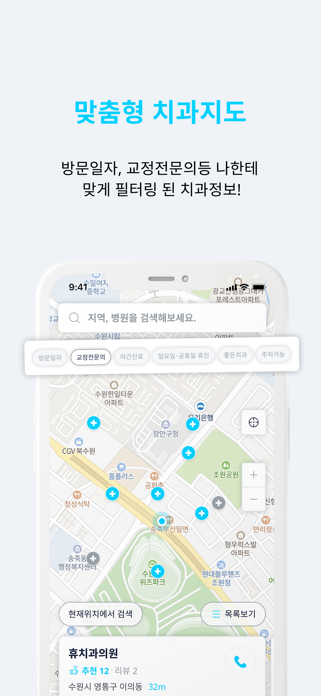
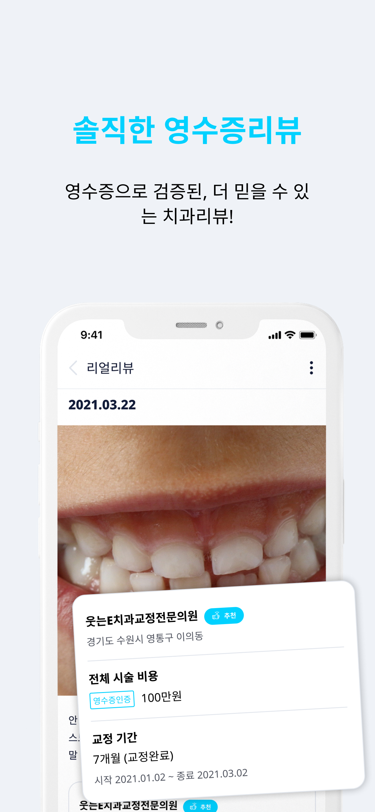
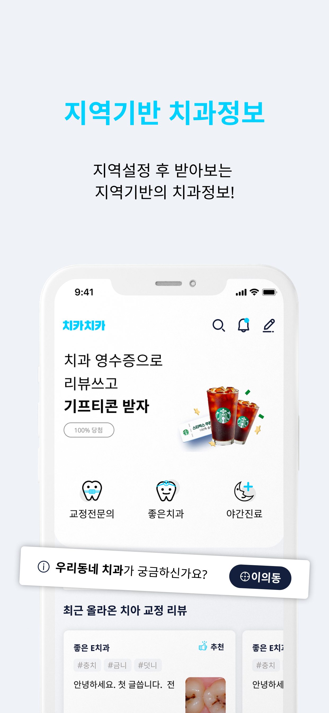

# 치카치카 - 개인 맞춤형 치과 서비스

## 프로젝트 개요
### • 주제
치카치카는 인터넷상 무분별한 치과 광고와 개인간의 입소문으로만 전해지는 정보에 의해  
나에게 맞고 믿을 수 있는 치과를 찾지 못하는 문제를 해결하기 위해 기획된 프로젝트입니다. 
### • 대표 사진

### • 참여
|이름|담당|기능|
|----|---|---|
|이재연 [(zaeyon)](github.com/zaeyon)|프론트엔드|로그인/회원가입, 치과지도, 리뷰작성 기능 담당|
|이태규 [(postmelee)](github.com/postmelee)|프론트엔드|커뮤니티, 홈화면 기능 담당|
|정지원 [(jiwon11)](https://github.com/jiwon11)|백엔드|백엔드 전체 기능 담당|
|전윤정|디자인||

### • 기간
2020.10 - 2021.03

## 기술 스택

<b>• Platform</b> - IOS, Android Mobild Application  
<b>• 프로그래밍 언어</b> - JavaScript, TypeScript  
<b>• UI 라이브러리</b> - React-Native  
<b>• CSS-In-JS 라이브러리</b> - styled-components  
<b>• 전역상태 관리</b> - Redux  
<b>• 지도</b> - Naver Map API

## 주요 기능
### 
